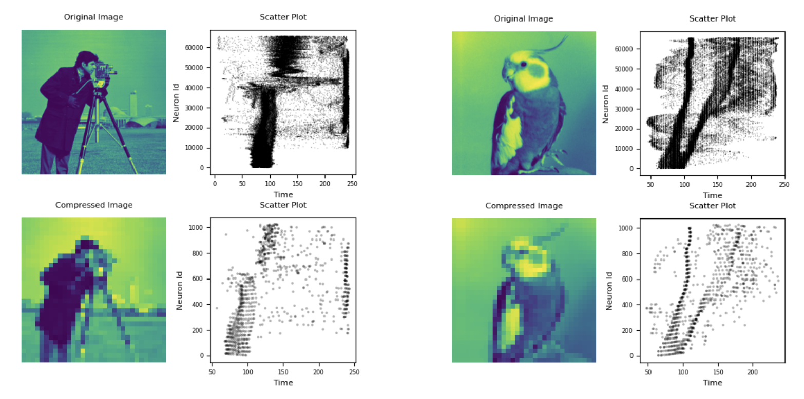

# Neural Coding and Learning Mechanisms in Neuroscience

This project focuses on various coding schemes and learning methods in neural networks, including **STDP** (Spike-Timing Dependent Plasticity) for unsupervised learning and **RSTDP** (Reward-modulated STDP) for reinforcement learning. It implements models for encoding spike-based information and adjusting synaptic weights in response to input stimuli.

## Table of Contents
- [Project Overview](#project-overview)
- [Implemented Features](#implemented-features)
- [How to Run](#how-to-run)
- [Results](#results)
- [References](#references)

## Project Overview
The aim of this project is to explore how different neural coding schemes and learning rules can be applied in neuronal networks. It covers spike-based coding strategies such as **Time To First Spike (TTFS)** and **Poisson Distribution Encoding**, as well as learning mechanisms like **STDP** and **RSTDP** for adjusting synaptic weights based on temporal relationships between spikes and rewards.

## Implemented Features
1. **Neural Coding Schemes**:
   - **Time To First Spike (TTFS)**: A method of encoding information based on the time of the first spike.
   - **Poisson Distribution Encoding**: Simulating neuron spiking based on Poisson-distributed input spikes.

<p align="center">
  
</p>

2. **Unsupervised Learning with STDP**:
   - **Spike-Timing Dependent Plasticity (STDP)**: Adjusts synaptic weights based on the temporal order of pre- and post-synaptic spikes.
   
3. **Reinforcement Learning with RSTDP**:
   - **Reward-modulated STDP (RSTDP)**: Synaptic plasticity is modulated by external rewards, where rewards reinforce useful patterns of activity.

4. **Synaptic Weight Dynamics**:
   - Tracks changes in synaptic weights under different input conditions (noisy fixed input, Poisson-distributed inputs).

5. **Cosine Similarity**:
   - Measures the similarity between synaptic weight vectors over time, showing the clustering of neurons in response to inputs.

6. **Inactive Neuron Impact**:
   - Analyzes how inactive neurons (neurons that do not spike) affect the overall synaptic weight dynamics.

## How to Run
1. Clone the repository:
   ```bash
   git clone https://github.com/mzamani18/Neural-Learning-and-Coding.git
2. Install the necessary dependencies:
   ```bash
   pip install -r requirements.txt
3. Run the simulation notebooks:
   - **For Encoding**: Open and run `Coding.ipynb`
   - **For STDP Learning**: Open and run `STDPLearning.ipynb`
   - **For RSTDP Learning**: Open and run `RSTDPLearning.ipynb`

   You can launch the notebooks using Jupyter by executing:
   ```bash
   jupyter notebook

## Results
Results from the simulations include:
- **Spike Raster Plots**: Visualizing the spiking activity of neurons under different input coding strategies.
- **Synaptic Weight Changes**: Charts showing how synaptic weights evolve over time in response to different input conditions.
- **Cosine Similarity**: Plots measuring the similarity between synaptic weight vectors over time, demonstrating clustering and separation.
- **Impact of Inactive Neurons**: Analysis of how inactive neurons affect synaptic dynamics and learning processes.

All simulation results and further analysis is available in the [report](./Report/Report-p03.pdf).


## References
- **Poisson Coding**: [Wikipedia Article on Poisson Distribution](https://en.wikipedia.org/wiki/Poisson_distribution)
- **Hebbian learning**: [Hebb Rule and Experiments](https://neuronaldynamics.epfl.ch/online/Ch19.S1.html)
- **Spike-Timing Dependent Plasticity (STDP)**: [Wikipedia Article on STDP](https://en.wikipedia.org/wiki/Spike-timing-dependent_plasticity)
- **Reward-modulated STDP (RSTDP)**: [Article on R-STDP](https://ieeexplore.ieee.org/document/8460482)
- **Neural Dynamics**: [Neural Dynamics Online Resources](https://neuronaldynamics.epfl.ch)
- **Cosine Similarity**: [Wikipedia Article on Cosine Similarity](https://en.wikipedia.org/wiki/Cosine_similarity)
